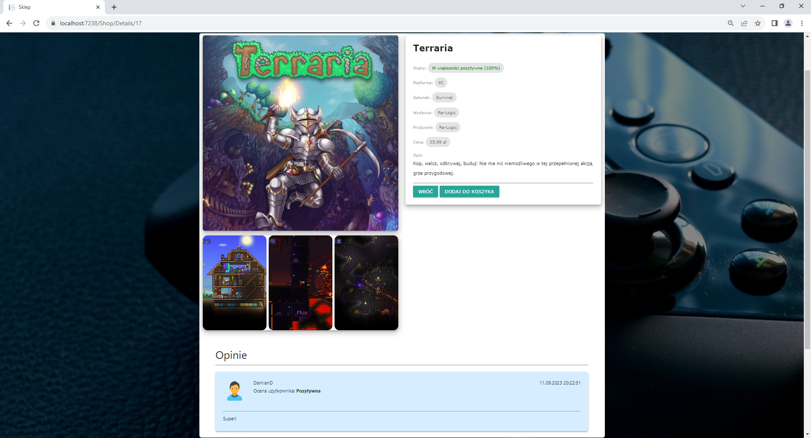

# GameStoreASP
"GameStore" internetowa aplikacja obsługująca sklep z grami, stworzona na potrzeby projektu szkolnego.

Projekt składa się z trzech aplikacji:
- PortalWWW - Aplikacja internetowa dla klientów, umożliwia przeglądanie i zamawianie produktów.
- Intranet - Aplikacja internetowa dla pracowników, służy do zarządzania danymi i zamówieniami.
- Data - Biblioteka obsługująca bazę danych.

## Wykorzystane technologie:

**Frontend**
- HTML/CSS
- JavaScript
- Bootstrap (Intranet - wersja dla pracownika)
- Materialize (PortalWWW - wersja dla klienta)

**Backend**
- C#
- ASP.NET 6.0
- Entity Framework

## Opis aplikacji:

**Funkcje aplikacji:**
- Logowanie/Rejestracja
- Zarządzanie kontem użytkownika
- Przeglądanie złożonych zamówień
- Składanie zamówień (Koszyk)
- Przeglądanie produktów
- Filtrowanie/wyszukiwanie produktów
- System ocen/recencji produktów
- Zarządzanie danymi w aplikacji (wersja dla pracownika)

## Wygląd aplikacji:

**PortalWWW**

Obraz 1. Główna strona aplikacji.

----

Obraz 2. Strona z produktami.

----

Obraz 3. Szczegóły danego produktu.

----

Obraz 4. Koszyk

----

Obraz 5. Składanie zamówienia

----

Obraz 6. Panel użytkownika

----

Obraz 7. Edycja danych użytkownika

----

Obraz 8. Szczegóły zamówienia użytkownika

----

Obraz 9. Ocena zakupionego produktu

----

Obraz 10. Panel dla pracownika

